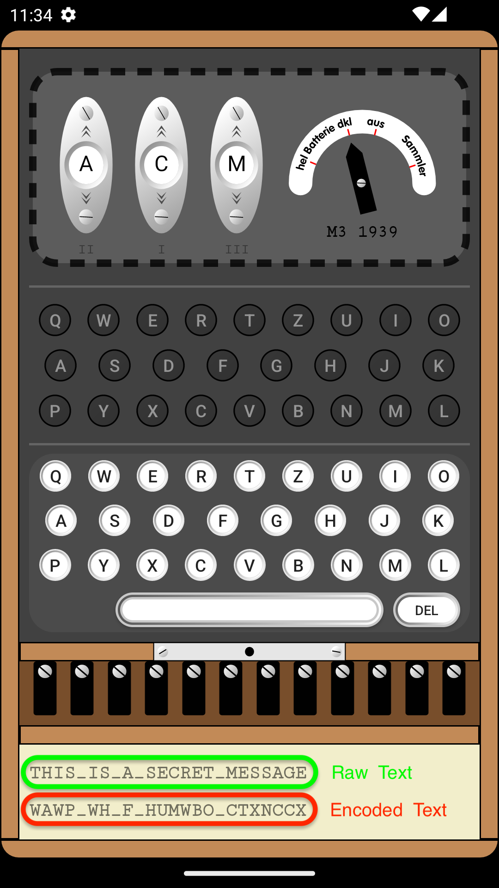
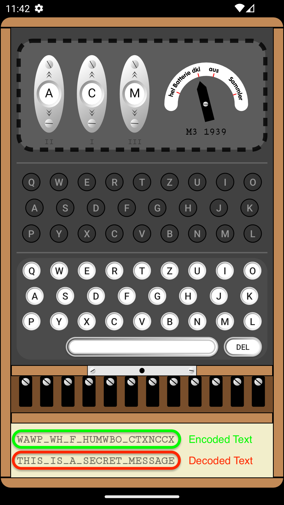

# Encode and Decode

## Settings

Before any encoding or decoding process, the most important thing is to note down the current settings of the machine. There are essentially five different settings we need to know for any encoding and decoding process. These five settings are the rotor slots, reflector option, ring options, plugboard pairings, and the rotor start positions. Here is an example of noting down the settings:

{ align=right style="width:50%"}

Suppose the images on the right represent the current settings of the enigma machine. Noting down the settings from that would yield:

- Rotor slot settings: I II III (Blue Box)
- Reflector Option: UKW-B (Red Box)
- Ring Option: A A A (Green Box)
- Plugboard Pairings: QW EY RF DX GV ZU BN JO MK IL (Brown Box)
- Rotor Start Positions: A B W (Yellow Box)

## Encoding

{ align=right style="width:40%"}

The first step before any encoding process is to choose the settings for the machine. After choosing the settings we desire and noting them down it is time for the encoding process. To encode a message, simply type the message into the keyboard. For each letter entered in the keyboard, a corresponding letter in the lamp-board will light up. The lit-up letter represents the encoded letter for the letter entered. The full encoded message can be obtained by keeping track of the letters that light up (This was how it was done in WW2) or by looking at the text-boxes at the bottom. The top text-box will have the raw message, and the bottom text-box will have the encoded message. Here is an example of encoding a message:

Suppose the settings we chose for the machine are:

- Rotor slot settings: II I III
- Reflector Option: UKW-B
- Ring Option: D B C
- Plugboard Pairings: QW EY RF DX GV ZU
- Rotor Start Positions: A B S

and the message we wish to encode is "THIS IS A SECRET MESSAGE." After typing the message in the keyboard we can see the encoded message in bottom text-box(red box).

## Decoding

{ align=right style="width:40%"}

The decoding process is just the inverse of the encoding process. To decode, the machine is first set to the settings that were used to encode the message. After that, the encoded message is entered into the keyboard. For each letter entered in the keyboard, a letter in the lamp-board will light up. The lit-up letter represents the decoded letter for the encoded letter entered. The full decoded message is obtained by noting down the letters that light up or by checking the text-boxes at the bottom. The top text-box will have the encoded message, and the bottom text-box will have the decoded message. Here is an example of decoding the message we made in the encoding section:

The settings we chose for the machine when encoded the message were:

- Rotor slot settings: II I III
- Reflector Option: UKW-B
- Ring Option: D B C
- Plugboard Pairings: QW EY RF DX GV ZU
- Rotor Start Positions: A B S

After setting the machine to these settings we type the encoded message which was "WAWP WH F HUMWBO CTXNCCX." After typing the message in the keyboard we can see the original message in bottom text-box(green box).