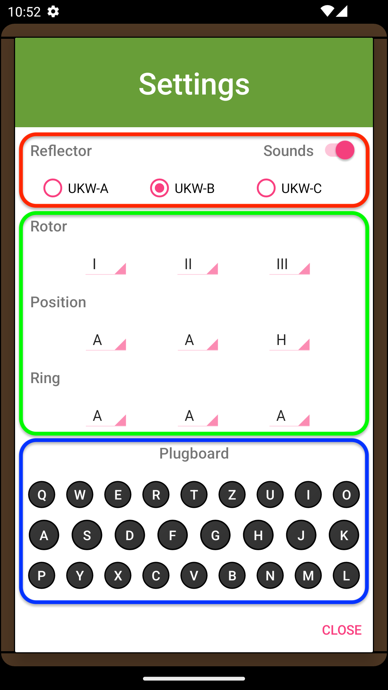

# App Layout

## Home Screen

The home screen serves as the command center for the Enigma Machine. It can be separated into three sections: Rotor Positions, Lampboard & Keyboard, and Text Field.

{ align=right style="width:50%"}

### Rotor Positions (Red)

The start positions for the three rotors can be adjusted through the three dials at the top of the home screen. The start position for each rotor can be adjusted either by clicking the arrows or by flicking vertically across the dial. 

### Lampboard & Keyboard (Green)

This is the main section of the home screen. Text can be inputted through the keyboard and the encoded letter can be seen in the lampboard. The app adds a space bar and delete key which was not available in the original Enigma Machine.

### Text (Blue)

The inputs of the keyboard and outputs of the lampboard are shown here. The top text represents keyboard inputs, while the bottom represents coded letters from the lampboard.

## Settings Screen

The settings page can be accessed by clicking the power switch. Once there, three major components that can be modified:

- Reflector
- Slots, Positions & Ring
- Plugboard 

Once new settings are chosen, they can be applied by clicking close. If any changes are made there will be a ring sound followed a toast message that says "New settings applied". If no changes are made then nothing happens.

{ align=right style="width:50%"}

### Reflector (Red)
User can choose which reflector they wish to use from the three options.

### Slots, Positions & Ring (Green)
The first row in this section allows the selection for which rotors should be in which slot. From left to right, the first drop down menu selects which rotor should be in the first slot, the second drop down menu selects which rotor should be in slot two, etc. The second and third rows set the position and ring settings of the rotors selected in the first row.

### Plugboard (Blue)
To make a plugboard pair the user must select two letters. Each pair will have a distinct color. To remove a pair, the user must click on one of the letters in the pair.